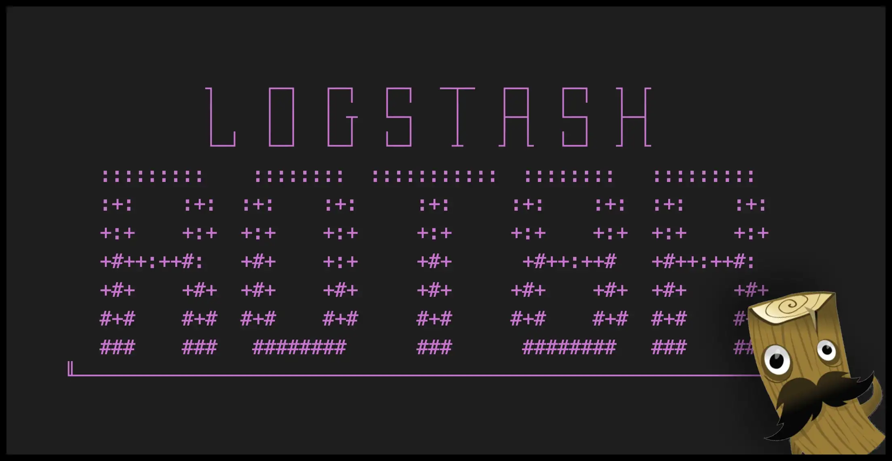
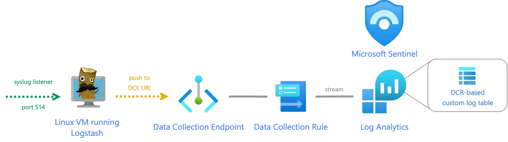
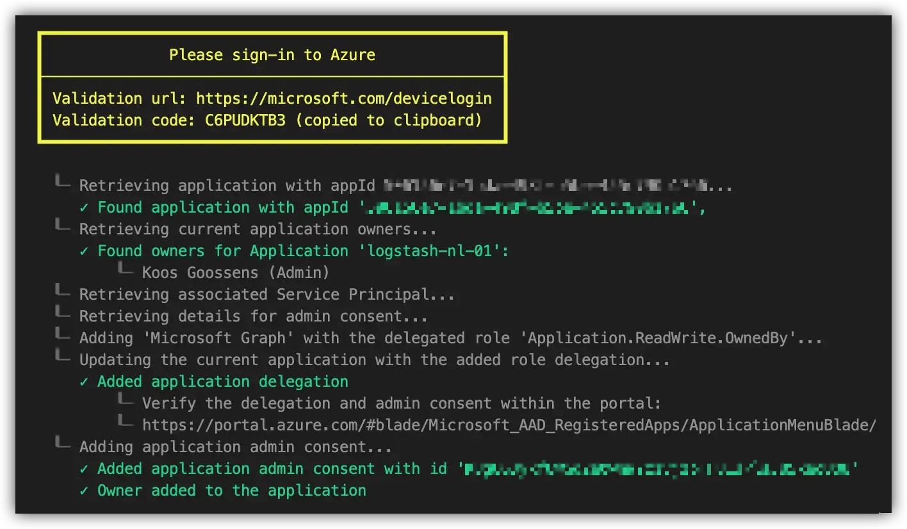
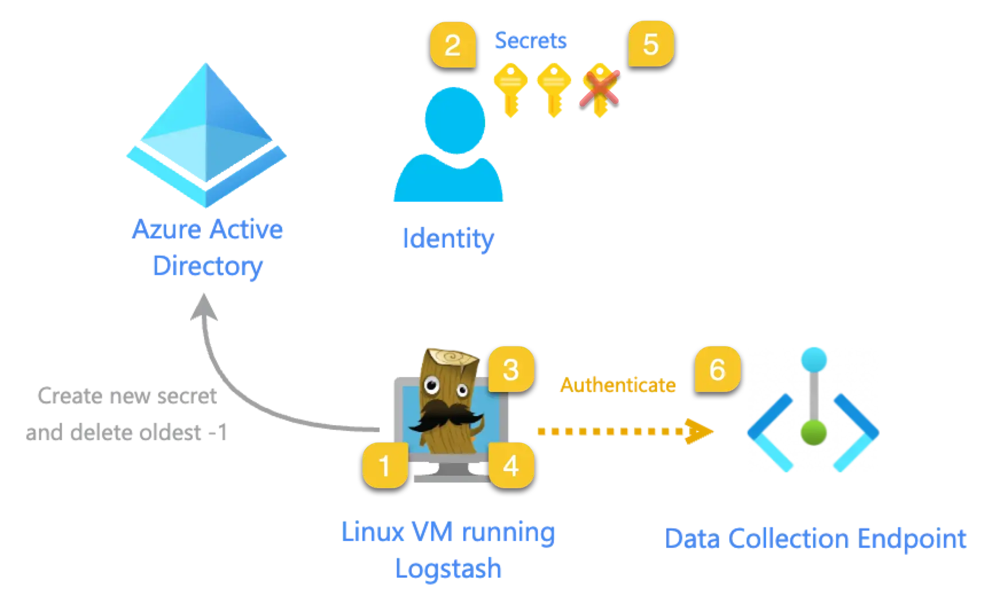
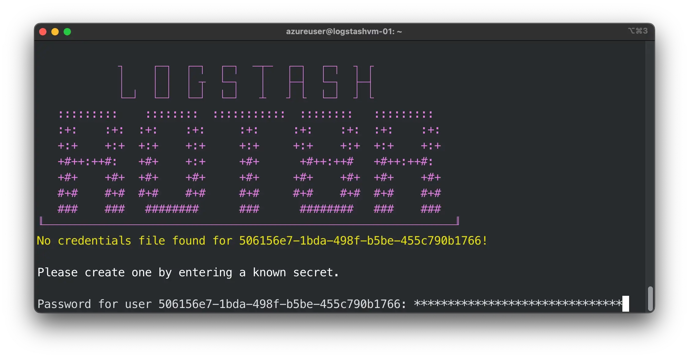

# Logstash Rot8r



## Introduction

Many companies struggle to implement automatic key rotation because most of their Logstash instances reside in on-premises infrastructure, where Infrastructure-as-Code principles don't exist. Therefore rotating and updating these secrets was all done manually, or worse; not at all!
So, I wanted to create a tool which could be implemented to automate this process. No matter where Logstash resides, how it was deployed in the first place nor what operating system it was running. Please let me introduce: Rot8r 🤖

> _For more in-depth background and details about DCR-based custom logs and how Rot8r works, check out [my article on Medium about this subject](https://koosg.medium.com/secure-logstash-to-microsoft-sentinel-and-azure-log-analytics-connections-a63e8c9cb9b8)._

## Use Logstash to ingest DCR-based custom logs into Microsoft Sentinel

In the last few months quite a lot of new features, regarding log ingestion for Sentinel were released. One of them is a completely reworked ingestion pipeline for custom logs providing lots of new abilities. Like on-the-fly transformation and filtering, and making use of a new 'basic' logs tier.

And with the new output plugin Microsoft released for Logstash, these feature can now also be used with your favorite log collecting tool!

### Why is this such a big deal?

Larger companies tend to have quite a few reason why they would favor Logstash over other "built-in" solutions Microsoft offers. The solution might require a little bit more effort, but in my opinion this tradeoff is definitely worth it.
Logstash pros over standard log collectors:

* Logstash can easily run inside a container on your favorite container platform (such as Azure Kubernetes Services) instead of having to deploy (and manage!) Virtual Machines. In my previous article about Logstash I went into more detail about creating a Logstash container. This makes it easy to create a highly available, more resilient log collector.
* With multiple pipelines inside Logstash, it's easier to define multiple listeners (inputs) to forward multiple sources to different tables (outputs) in Microsoft Sentinel.
* Logstash can filter on-the-fly log ingestion before it is send out to the Microsoft agent pushing it into Sentinel. This is huge! Especially for network logs.
* With Logstash's wide variety on input plugin, the type of sources you can collect logs from are essentially endless. [I've described PostgreSQL data ingestion in the past](https://koosg.medium.com/get-insights-on-postgresql-data-with-azure-sentinel-8e25c32b8823).



> _Overview of ingesting DCR-based custom logs with Logstash_

### Logstash configuration file

Example pipeline configuration file could look something like this:

```bash
input {
     syslog {
         port => 5514
    }
}

output {
    microsoft-sentinel-logstash-output-plugin {
        client_app_Id => "< applicationId >"
        client_app_secret => "myapplicationsecret"
        tenant_id => "< tenantId >"
        data_collection_endpoint => "https://< DCE URI >.westeurope-1.ingest.monitor.azure.com"
        dcr_immutable_id => "dcr-< immutableId >"
        dcr_stream_name => "Custom-< tableName_CL >"
    }
}
```

## Before you start

Before we can start using Rot8r, we need to make sure our Azure AD application is prepared and ready so that it's able to update its own keys.

### Install PowerShell Core on Linux

Since PowerShell went open-source as "PowerShell Core" version 6 in 2016, we also gained the capabilities of running PowerShell cross-platform on Linux and MacOS for example.

I used Ubuntu for this example and it was very straightforward:

```bash
# Update the list of packages
sudo apt-get update
# Install pre-requisite packages.
sudo apt-get install -y wget apt-transport-https software-properties-common
# Download the Microsoft repository GPG keys
wget -q "https://packages.microsoft.com/config/ubuntu/$(lsb_release -rs)/packages-microsoft-prod.deb"
# Register the Microsoft repository GPG keys
sudo dpkg -i packages-microsoft-prod.deb
# Update the list of packages after we added packages.microsoft.com
sudo apt-get update
# Install PowerShell
sudo apt-get install -y powershell
# Start PowerShell
pwsh
```

> _[Microsoft describes how to install PowerShell on all different Linux distributions in their documentation.](https://learn.microsoft.com/en-us/powershell/scripting/install/installing-powershell-on-linux?view=powershell-7.3)_

### Application permission requirements

* Application needs to be owner of it’s own application.
* Application requires the following Microsoft.Graph permission: `Application.ReadWrite.OwnedBy`.

The main problem is that the Azure portal will not allow us to add the application as an owner for itself. But luckily the Graph API allows us to work around this.

Therefore I've created a PowerShell script `Add-AppOwner.ps1` to help you with these steps. This script needs to be run one time only to setup the proper permissions for this application.

To run this script you need to following permissions:
Global Administrator, or have all of the following permissions:

* `Application.ReadWrite.All`
* `Directory.Read.All`
* `AppRoleAssignment.ReadWrite.All`

The script Add-AppOwner.ps1 will:

* Ask to perform an interactive device login. (the validation code will be copied to clipboard for your convenience 😉)
* Validate the applicationId
* Retrieve the current owner(s)
* Add the application delegation for Microsoft.Graph permission `Application.ReadWrite.OwnedBy`
* Perform the admin consent for the application delegation Microsoft.Graph permission `Application.ReadWrite.OwnedBy`
* Add the service principal to the application as owner



### Create first secret manually

There's one last thing to do and that's creating the very first secret. Once Rot8r is scheduled to run regularly, this secret will automatically be "rotated" away and removed. But make sure to copy the password somewhere for your first Rot8r run. After this first run the secret will no longer be needed.

## Logstash-Rot8r.ps1

This tool can be run from the (Linux) machine running Logstash. Best is to schedule it (with cron) to make sure the secret is rotated automatically.

With Rot8r you can shorten your lifespan of your secrets drastically. You can even consider running this daily and keep the lifespan of your secrets as short as a few days!

When using this in conjunction with Logstash keystore, the secret is no longer visible in plain text anywhere on the server. And because the rotation task is fully automated, nobody needs to even know what the current key value is!

### Overview



1. After Rot8r is started (i.e. by a scheduled task or cron job) it will authenticate towards Azure Active Directory using the same credentials as Logstash uses to ingest logs into Sentinel. The secret PowerShell uses to authenticate is pulled from a secure `.cred` file. More on this below…
2. It wil generate an additional secret with a limited lifecycle (default of 31 days)
3. The newly created secret is encrypted and stored again in the secure `.cred` file, overwriting the previous one.
4. Depending on the parameters provided either one of two things will happen next:
    1. Logstash configuration file (path provided as parameter) is read, and the existing secret is replaced with the newly generated one.
    2. A Logstash keystore key (provided as parameter) is updated with the new value of the newly created secret.
5. All secrets, minus the two most recent ones, are deleted.
6. Logstash system service is restarted to immediately make sure changes are in effect and using the latest configuration change.

#### PowerShell .cred file

The latest secret is always stored into a `.cred` file for the next run of Rot8r. This file contains the System.Security.SecureString PowerShell uses to encrypt passwords.

> _To read more about SecureString and how secure these are, please [see Microsoft's documentation about this subject](https://learn.microsoft.com/en-us/dotnet/api/system.security.securestring?view=net-7.0#remarks)._

Upon first run this file doesn't exist yet, therefore Rot8r will ask you to provide a secret (you've created this during preparation steps above) so that it can create its first `.cred` file:



### Parameters

Rot8r's behavior can be modified with a couple of parameters:

| Parameter | isRequired? | Description |
| --- | --- | --- |
| `secretAddDays` | false | The number of days the new application secret will be valid. Default is for 31 days. |
| `tenantId` | true | The Tenant ID of the Azure Active Directory in which the application resides. |
| `applicationId` | true | The applicationId of the application on which the secret needs to be rotated. |
| `logstashConfigLocation` | false | Path to logstash pipeline configuration file i.e. '/etc/logstash/conf.d/syslog-to-sentinel.conf' |
| `logstashKeystoreKey` | false | Name of the key in the keystore container the app secret referenced inside the Logstash configuration file. |
| `printOutput` | false | Add '-printOutput' for easier troubleshooting external Logstash-specific commands, like updating keystore key and restarting service. |

### Examples

#### Example with config file

`sudo pwsh -File logstash-rot8r.ps1 -tenantId <tenant_id> --applicationId <app_id> -logstashConfigLocation /etc/logstash/conf.d/syslog-to-sentinel.conf`

Where -logstashConfigLocation refers to the physical location of the Logstash pipeline configuration you wish to apply key rotation on.

#### Example with keystore

`sudo pwsh -File logstash-rot8r.ps1 -tenantId <tenant_id> --applicationId <app_id> -logstashKeystoreKey sentinel_app_id`

Where -logstashKeystoreKey refers to a key saved in the Logstash keystore.

> _**It’s important to note that you either provide a logstashConfigLocation OR a logstashKeystoreKey and not both!**_

As mentioned above, the Logstash keystore might rely on an environment variable containing the keystore’s master password. (depending on your setup) This variable and the physical location of the keystore file(s) should be accessible by the user running ‘Rot8r’. If updating the keystore key fails, you might want to consider adding the printOutput switch so that these steps are no longer verbose, and the results can be viewed in the console.

`sudo pwsh -File logstash-rot8r.ps1 -tenantId <tenant_id> --applicationId <app_id> -logstashKeystoreKey sentinel_app_id -printOutput`

![Rot8r successful](.images/rot8r-success.png
